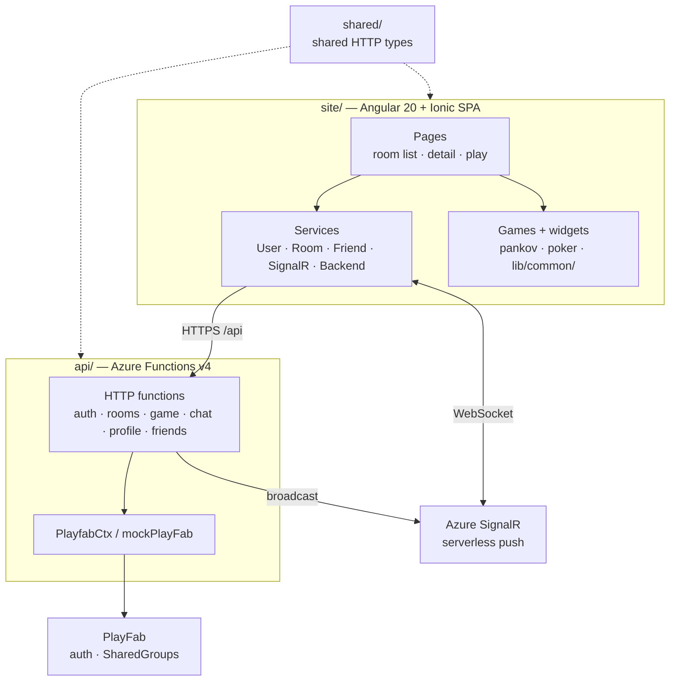

# Architecture

Notes:
- Client → server is HTTPS `POST /api/...`; server → client updates are pushed over Azure SignalR (no polling).
- The API is a stateless proxy: state lives in PlayFab SharedGroups via `PlayfabCtx`, swapped for an in-memory simulation when `MOCK_BACKEND=true`.
- Games aren't routed — `RoomPlayComponent` mounts the component from the game's `GAME_REGISTRY` entry and drives it via inputs/outputs.
