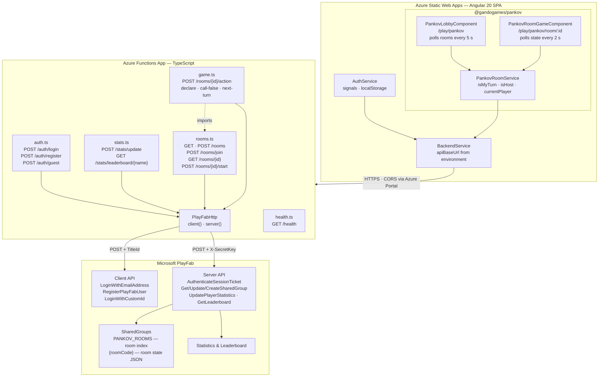

# Architecture

```mermaid
graph TB
    subgraph SWA["Azure Static Web Apps — Angular 20 SPA"]
        AuthSvc["AuthService\nsignals · localStorage"]
        BackendSvc["BackendService\napiBaseUrl from environment"]

        subgraph Pankov["@gandogames/pankov"]
            PLobby["PankovLobbyComponent\n/play/pankov\npolls rooms every 5 s"]
            PGame["PankovRoomGameComponent\n/play/pankov/room/:id\npolls state every 2 s"]
            PSvc["PankovRoomService\nisMyTurn · isHost · currentPlayer"]
        end

        PLobby --> PSvc
        PGame --> PSvc
        AuthSvc --> BackendSvc
        PSvc --> BackendSvc
    end

    subgraph API["Azure Functions App — TypeScript"]
        PFHttp["PlayFabHttp\nclient() · server()"]

        FHealth["health.ts\nGET /health"]
        FAuth["auth.ts\nPOST /auth/login\nPOST /auth/register\nPOST /auth/guest"]
        FStats["stats.ts\nPOST /stats/update\nGET /stats/leaderboard/{name}"]
        FRooms["rooms.ts\nGET · POST /rooms\nPOST /rooms/join\nGET /rooms/{id}\nPOST /rooms/{id}/start"]
        FGame["game.ts\nPOST /rooms/{id}/action\ndeclare · call-false · next-turn"]

        FAuth --> PFHttp
        FStats --> PFHttp
        FRooms --> PFHttp
        FGame -.->|imports| FRooms
        FGame --> PFHttp
    end

    subgraph PlayFab["Microsoft PlayFab"]
        PFClient["Client API\nLoginWithEmailAddress\nRegisterPlayFabUser\nLoginWithCustomId"]
        PFServer["Server API\nAuthenticateSessionTicket\nGet/Update/CreateSharedGroup\nUpdatePlayerStatistics · GetLeaderboard"]
        PFSG["SharedGroups\nPANKOV_ROOMS — room index\n{roomCode} — room state JSON"]
        PFStats["Statistics & Leaderboard"]
    end

    BackendSvc -->|"HTTPS · CORS via Azure Portal"| API
    PFHttp -->|"POST + TitleId"| PFClient
    PFHttp -->|"POST + X-SecretKey"| PFServer
    PFServer --> PFSG
    PFServer --> PFStats
```
