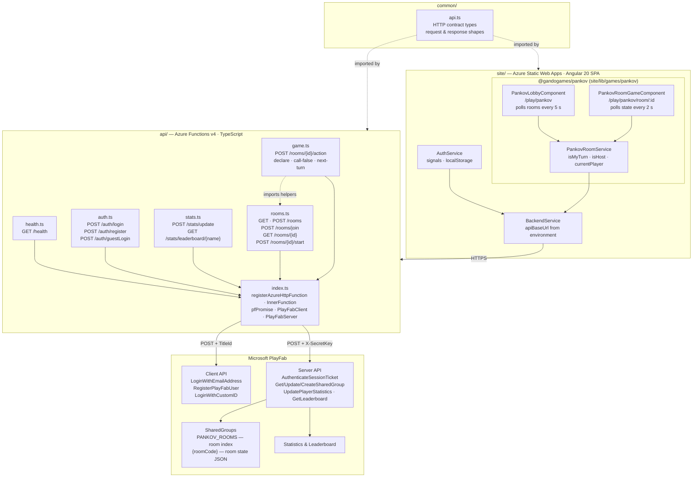

# Architecture

```mermaid
graph TB
    subgraph Common["common/"]
        CApi["api.ts\nHTTP contract types\nrequest & response shapes"]
    end

    subgraph SWA["site/ — Azure Static Web Apps · Angular 20 SPA"]
        AuthSvc["AuthService\nsignals · localStorage"]
        BackendSvc["BackendService\napiBaseUrl from environment"]

        subgraph Pankov["@gandogames/pankov  (site/lib/games/pankov)"]
            PLobby["PankovLobbyComponent\n/play/pankov\npolls rooms every 5 s"]
            PGame["PankovRoomGameComponent\n/play/pankov/room/:id\npolls state every 2 s"]
            PSvc["PankovRoomService\nisMyTurn · isHost · currentPlayer"]
        end

        PLobby --> PSvc
        PGame --> PSvc
        AuthSvc --> BackendSvc
        PSvc --> BackendSvc
    end

    subgraph API["api/ — Azure Functions v4 · TypeScript"]
        Barrel["index.ts\nregisterAzureHttpFunction · InnerFunction\npfPromise · PlayFabClient · PlayFabServer"]

        FHealth["health.ts\nGET /health"]
        FAuth["auth.ts\nPOST /auth/login\nPOST /auth/register\nPOST /auth/guestLogin"]
        FStats["stats.ts\nPOST /stats/update\nGET /stats/leaderboard/{name}"]
        FRooms["rooms.ts\nGET · POST /rooms\nPOST /rooms/join\nGET /rooms/{id}\nPOST /rooms/{id}/start"]
        FGame["game.ts\nPOST /rooms/{id}/action\ndeclare · call-false · next-turn"]

        FHealth --> Barrel
        FAuth --> Barrel
        FStats --> Barrel
        FRooms --> Barrel
        FGame --> Barrel
        FGame -.->|imports helpers| FRooms
    end

    subgraph PlayFab["Microsoft PlayFab"]
        PFClient["Client API\nLoginWithEmailAddress\nRegisterPlayFabUser\nLoginWithCustomID"]
        PFServer["Server API\nAuthenticateSessionTicket\nGet/Update/CreateSharedGroup\nUpdatePlayerStatistics · GetLeaderboard"]
        PFSG["SharedGroups\nPANKOV_ROOMS — room index\n{roomCode} — room state JSON"]
        PFStats["Statistics & Leaderboard"]
    end

    CApi -.->|imported by| SWA
    CApi -.->|imported by| API
    BackendSvc -->|HTTPS| API
    Barrel -->|"POST + TitleId"| PFClient
    Barrel -->|"POST + X-SecretKey"| PFServer
    PFServer --> PFSG
    PFServer --> PFStats
```
